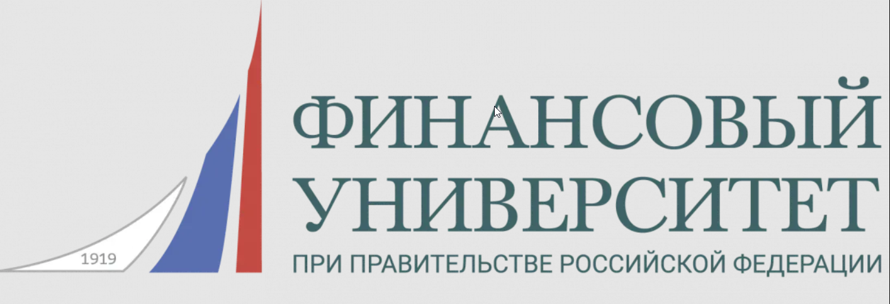

   <h1>
Привет, меня зовут Екатерина 👋
   </h1>

<!--About me-->

## :technologist:Обо мне
* Ручной и Авто инженер по тестированию ПО
* 5 лет в QA
* Пишу автотесты на Python
* Мои контакты:
   

  
  
----

<!--Education-->
## :man_student:Образование
<table width="100%" border='0'>
   <tr> 
    <td width="30%" valign="bottom"></td><td valign="middle">Школа QA - <a target="_blank" href="https://qa.guru">qa.guru</a> Инженер по автоматизации тестирования на Python <a target="_blank" href="https://drive.google.com/file/d/1INwdf9vmHwOnQfw-v5ciTAVqAaQPJAZZ/view?usp=sharing">Сертификат</td></tr>
    <td width="30%" valign="bottom"></td><td valign="middle">Финансовый университет при Правительстве Российской Федерации (бывший ВЗФЭИ) Финансист</td></tr>
    <td width="30%" valign="bottom"></td><td valign="middle">Новороссийский колледж строительства и экономики Программист ВТ и АИС</td></tr>
   </tr>
  </table>
   

----

<!--Stack and tools-->
## :computer:Технологии и инструменты:

  <code></code>
  <code></code>
  <code></code>
  <code></code>
  <code></code>
  <code></code>

  <code></code>
  <code></code>
  <code></code>
  <code></code>
  <code></code>
  <code></code>

  <code></code>
  <code></code>
  <code></code>
  <code></code>
  <code></code>
  <code></code>
  <code></code>

----
<!--Projects-->
## 	:rocket:Дипломный проект
Реализован во время обучения в Школе QA - <a target="_blank" href="https://qa.guru">qa.guru</a>
- <a target="_blank" href="https://github.com/karelova2303/pinterest_project_tests">Тестирование UI</a>
- <a target="_blank" href="https://github.com/karelova2303/petstore_api_project">Тестирование REST API</a>
- <a target="_blank" href="https://github.com/karelova2303/wiki_project_mobile">Тестирование мобильного приложения</a>
